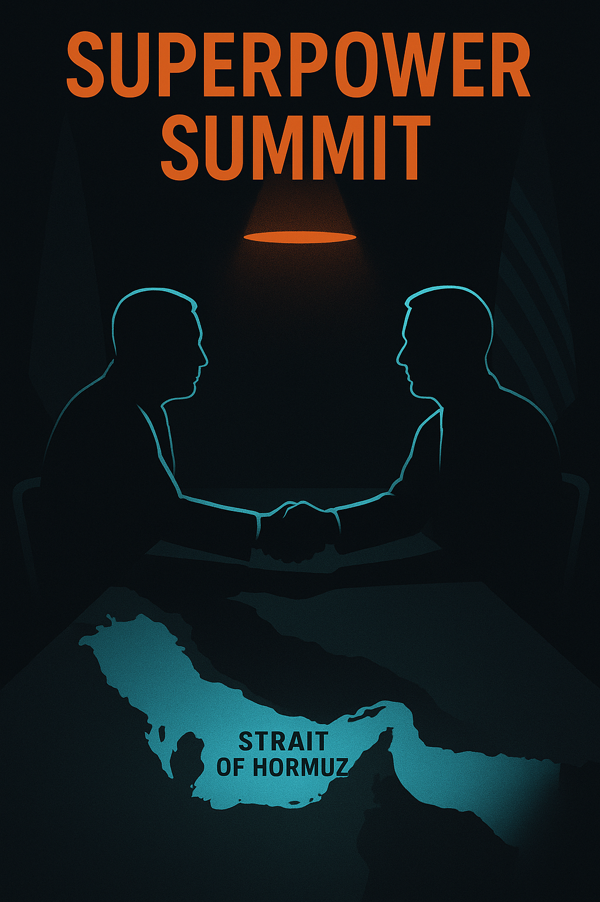

# Trump touts 'fantastic' trade deals as US-China summit concludes.

**Who's posting:** guardian (2), x_afp (2), aljazeera (1), x_reuters (1), x_ap (1), fox (1)  
**Lean mix:** center=4, center-left=3, right=1

## Sources on the wire

### 🟦 `guardian` — center-left (2 posts)
- [Trump China visit live: US president says a lot of problems ‘settled’, as he meets with Xi on final day of summit](https://www.theguardian.com/world/live/2026/may/15/trump-china-visit-live-updates-xi-jinping-talks-meeting-summit-latest-news) — _2026-05-15T10:10_
- [Xi warns Trump of ‘clashes and even conflicts’ with US over Taiwan](https://www.theguardian.com/world/2026/may/14/trump-xi-jinping-meet-beijing-ahead-of-summit-trade-iran-war-ai-talks) — _2026-05-14T17:37_

### ⬜ `x_afp` — center (2 posts)
- [🇺🇸 🇨🇳 President Donald Trump says he had made "fantastic trade deals" with China's Xi Jinping, as the pair ended a superpower summit that according to the US leader has also reaped](https://twitter.com/AFP/status/2055229206565405114#m) — _2026-05-15T10:10_
- [Trump says he has made "fantastic trade deals" with Xi Jinping, as the pair met on Friday at final meetings of a superpower summit that according to the US leader has also reaped a](https://twitter.com/AFP/status/2055148561424154644#m) — _2026-05-15T04:49_

### 🟦 `aljazeera` — center-left (1 post)
- [Trump and Xi move towards business-first relationship after Beijing summit](https://www.aljazeera.com/news/2026/5/15/trump-and-xi-move-towards-business-first-relationship-after-beijing-summit?traffic_source=rss) — _2026-05-15T09:46_

### ⬜ `x_reuters` — center (1 post)
- [US President Donald Trump boasted of progress on trade following a second day of talks with Xi Jinping in Beijing and claimed the Chinese leader signaled a desire to help on Iran h](https://twitter.com/Reuters/status/2055213958920044594#m) — _2026-05-15T09:09_

### ⬜ `x_ap` — center (1 post)
- [BREAKING: Presidents Donald Trump and Xi Jinping wrap up critical US-China talks claiming progress in stabilizing ties even as differences persist between the two biggest world pow](https://twitter.com/AP/status/2055177088538124587#m) — _2026-05-15T06:42_

### 🟥 `fox` — right (1 post)
- [Trump reveals Xi’s stance on arming Iran as Hormuz tensions rattle markets](https://www.foxnews.com/politics/trump-reveals-xis-stance-arming-iran-hormuz-tensions-rattle-markets) — _2026-05-15T04:08_

## Cross-outlet read

**Story grade:** 8/10

**Per-outlet framing:**
- `guardian` — Trump claims 'a lot of problems settled' after summit with Xi.
- `x_afp` — wire repeat
- `aljazeera` — Trump and Xi shift towards a business-first relationship.
- `x_reuters` — wire repeat
- `x_ap` — wire repeat
- `fox` — Xi's pledge on Iran arms seen as a major win for Trump.

**Framing divergence:**
- [guardian, fox] Xi pledged not to send weapons to Iran.
- [aljazeera, guardian] Key differences on Iran and Taiwan remain unresolved.

**Public-opinion sway:** polarizing · ~15pp over ~10d
- ↗ business_leaders, conservatives
- ↘ progressives, foreign_policy_experts
- _Trump says 'a lot of good' has come from summit and 'we’ve made some fantastic trade deals for both countries'._

**Next inflection:** Monitor for any formal trade agreement announcements by the end of Q2 2026. Watch for China's next moves on Iran and Taiwan policy.

## Persona panel

**Panel:** aisha, devon, james, maria
**Consensus:** 12c YES

- **aisha** (25c): Trump's 'fantastic' talk is just that - talk. Real trade deals take months to draft and get through Congress, especially with Taiwan tensions still hot. I'm thinking 25% on YES - if it hits, we'll see fewer supply chain headaches at the hospital.
- **devon** (22c): Aisha's 25c feels about right — Trump's 'fantastic' claims have a base rate of maybe 30% translating to actual signed agreements within 18 months. Market's probably pricing in too much hopium given the Taiwan warnings and Congressional gridlock on anything China-related. 22c on YES, small size.
- **james** (18c): Devon's 22c looks reasonable but I'm fading it down to 18c - Xi's Hormuz pivot smells like classic misdirection while Taiwan warnings signal zero appetite for real concessions. Congress will torpedo anything substantive on China trade before midterms, and Trump's victory-lap rhetoric is pure theater for the base. Maria, what's your read on how EU positioning affects the timeline here?
- **maria** (12c): James, I think 18c is still too generous - as a mom watching grocery prices, I've seen Trump promise trade wins before that never showed up in my cart. Between Taiwan tensions and Congress being Congress, I'd bet this at 12% max - these summits are great photo ops but terrible at actually moving the needle on real trade policy. The timing through Q2 2026 with midterms looming makes it even less likely anything substantial gets done.
- **aisha** (12c): Maria's 12c feels right - I've watched too many 'breakthrough' summits turn into nothing while drug prices kept climbing. Congress won't touch China trade before midterms, and Taiwan warnings mean Xi's not giving Trump any real wins to crow about. 12% on YES, and if it somehow hits, maybe we'll finally see those medical supply chains stabilize.
- **devon** (12c): 12c is the right fade — the base rate on Trump trade announcements actually materializing into Congressional approval is brutal, maybe 15% historically. Taiwan warnings plus Xi offering Hormuz help (lol) screams classic diplomatic theater where both sides claim wins while changing nothing structural. Taking 12c on YES, posting receipt if I get filled.

## Polymarket angle

**Polymarket angle (proposed market):** _Will the US and China announce a formal trade agreement by end of Q2 2026?_  
slug: `us-china-trade-agreement-q2-2026` — full spec in `higgsfield.json#polymarket`

## Hero (reference image for Higgsfield)



## Higgsfield video prompt

```
In a grand hall with flags of two superpowers, silhouettes of leaders shake hands across a long table. The room is dimly lit, with a spotlight on the handshake, casting long shadows. A map of the Strait of Hormuz glows subtly in the background.
```

- camera: `dolly_in`
- aspect: `16:9`
- duration: `8s`
- ref image: `./hero.png`

Drop `higgsfield.json` into the Higgsfield API to render.

_Event ID: `2026-05-15-trump-touts-fantastic-trade-deals-as-us-china-summit-concludes`._
