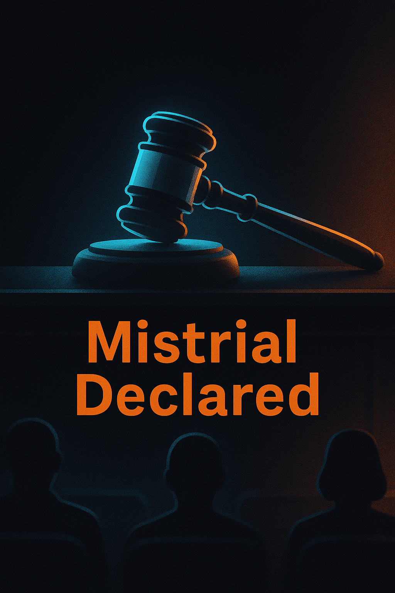

# Harvey Weinstein's New York rape trial ends in mistrial.

**Who's posting:** x_afp (2), npr (1), x_bbc_breaking (1), x_nytimes (1), x_ap (1)  
**Lean mix:** center=4, left=1, center-left=1

## Sources on the wire

### ⬜ `x_afp` — center (2 posts)
- [A judge has declared a mistrial in the trial of disgraced cinema mogul Harvey Weinstein after jurors failed to reach a verdict on allegations he sexually assaulted actor Jessica Ma](https://twitter.com/AFP/status/2055508366722748543#m) — _2026-05-16T04:39_
- [#BREAKING A US judge declared a mistrial in the case of disgraced cinema mogul Harvey Weinstein after jurors again failed to reach a verdict on allegations he sexually assaulted ac](https://twitter.com/AFP/status/2055352319756087709#m) — _2026-05-15T18:19_

### 🟦 `npr` — left (1 post)
- [Harvey Weinstein's third sex crimes trial in New York ends in mistrial](https://www.npr.org/2026/05/15/nx-s1-5823745/harvey-weinstein-trial-hung-jury-mistrial-2026) — _2026-05-15T18:02_

### ⬜ `x_bbc_breaking` — center (1 post)
- [Harvey Weinstein's New York rape trial ends in mistrial as jury fails to reach verdict https://bbc.in/4ww0Wj5](https://twitter.com/BBCBreaking/status/2055342590820491400#m) — _2026-05-15T17:40_

### 🟦 `x_nytimes` — center-left (1 post)
- [Breaking News: Harvey Weinstein’s rape trial in New York ended in a mistrial after the jury was unable to reach a verdict. It’s the second time a jury has not returned a verdict on](https://twitter.com/nytimes/status/2055339188690571714#m) — _2026-05-15T17:27_

### ⬜ `x_ap` — center (1 post)
- [BREAKING: Judge declares a mistrial in Harvey Weinstein’s rape retrial after the jury says it is deadlocked. https://apnews.com/article/harvey-weinstein-rape-retrial-jury-deliberat](https://twitter.com/AP/status/2055337249630216482#m) — _2026-05-15T17:19_

## Cross-outlet read

**Story grade:** 8/10

**Per-outlet framing:**
- `x_afp` — wire repeat
- `npr` — Emphasizes it's the second time in a year a jury was unable to reach a verdict.
- `x_bbc_breaking` — wire repeat
- `x_nytimes` — Notes it's the second time a jury has not returned a verdict on that charge.
- `x_ap` — wire repeat

**Framing divergence:**
- [npr, x_nytimes] This is the second time a jury has not reached a verdict on this charge.

**Public-opinion sway:** polarizing · ~15pp over ~90d
- ↗ legal professionals
- ↘ survivor advocates
- _It was the second time in a year a jury was unable to reach a verdict._

**Next inflection:** Monitor for announcements on whether Weinstein will face a new trial by the end of 2026.

## Persona panel

**Panel:** aisha, devon, james, maria
**Consensus:** 22c YES

- **aisha** (25c): Third trial, same deadlock - prosecutors are running out of steam and public attention. System's grinding down everyone involved, including Mann who's testified three times now. I'm at 25c on YES - they'll try once more but momentum's fading fast.
- **devon** (45c): 25c feels low given the sunk costs and institutional momentum - DA's office has political incentives to keep pursuing this, especially with the 2020 conviction getting overturned. Base rate for high-profile prosecutorial persistence after mistrials is way higher than implied here. I'll take 45c on YES.
- **james** (28c): 45c is rich - prosecutors are bleeding resources on a case that's already hung twice, and Mann's credibility degrades with each re-telling. Post-MeToo fatigue is real, DAs pivot to easier wins when conviction odds crater. I'd fade this to 28c max.
- **maria** (35c): As a mom watching this unfold, I keep thinking about the victim here - three times testifying has to be absolutely brutal, and at some point the system has to ask if putting her through this again is fair. The prosecutors are in a tough spot politically, but they're also burning through taxpayer money on a case that's deadlocked twice now. I'd give it maybe 35% they try one more time, but honestly I think everyone's exhausted at this point.
- **aisha** (25c): Maria's right about the victim trauma - I see what repeat testimony does to people in the ER, it's brutal. But James is wrong about resources - high-profile cases like this get different budget treatment, and the DA can't look soft on sexual assault. I'll stick at 25c - third mistrial killed the momentum, and even prosecutors know when a case is unsalvageable.
- **devon** (22c): I think 35c is rich, fade it to 22c. The conviction-after-multiple-mistrials base rate is abysmal - like 15% historically - and that's before accounting for witness fatigue degrading testimony quality each iteration. DA offices optimize for win rates over justice theater when the cameras aren't rolling.
- **james** (20c): Devon's finally pricing this correctly - 22c is fair value given the abysmal conviction rates post-double mistrial. Prosecutors know a third hung jury would be career poison, and Mann's testimony has already been stress-tested twice by defense counsel. I'm comfortable at 22c, maybe a shade lower given the resource burn and optics nightmare.

## Polymarket angle

**Polymarket angle (proposed market):** _Will Harvey Weinstein face a new trial by end of 2026?_  
slug: `harvey-weinstein-new-trial-by-end-2026` — full spec in `higgsfield.json#polymarket`

## Hero (reference image for Higgsfield)



## Higgsfield video prompt

```
In a dimly lit courtroom, a silhouetted jury box stands empty, casting long shadows. An empty judge's bench looms in the background, symbolizing unresolved justice. The atmosphere is tense, with a single spotlight highlighting the empty witness stand.
```

- camera: `dolly_out`
- aspect: `16:9`
- duration: `8s`
- ref image: `./hero.png`

Drop `higgsfield.json` into the Higgsfield API to render.

_Event ID: `2026-05-16-harvey-weinstein-s-new-york-rape-trial-ends-in-mistrial`._
