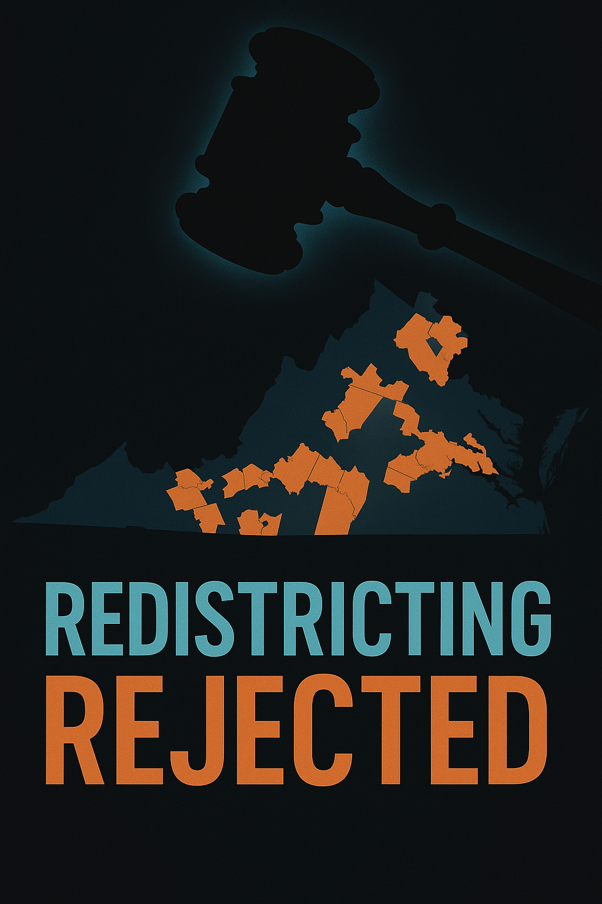

# Supreme Court blocks Virginia Democrats' redistricting effort.

**Who's posting:** x_ap (2), x_politico (1), x_nytimes (1), fox (1), npr (1)  
**Lean mix:** center=3, center-left=1, right=1, left=1

## Sources on the wire

### ⬜ `x_politico` — center (1 post)
- [Supreme Court rejects bid to revive Democrats’ Virginia redistricting plan http://dlvr.it/TSYtKP](https://twitter.com/politico/status/2055434631839969455#m) — _2026-05-15T23:46_

### 🟦 `x_nytimes` — center-left (1 post)
- [Breaking News: The Supreme Court rejected Virginia Democrats’ last-ditch effort to save a House map with new Democratic-leaning districts. https://nyti.ms/3RbXw56](https://twitter.com/nytimes/status/2055430553583730918#m) — _2026-05-15T23:30_

### 🟥 `fox` — right (1 post)
- [Supreme Court deals blow to Virginia Democrats in fight over state court election map ruling](https://www.foxnews.com/politics/supreme-court-deals-blow-virginia-democrats-fight-over-state-court-ruling) — _2026-05-15T23:03_

### 🟦 `npr` — left (1 post)
- [Supreme Court is death knell for Virginia's Democratic-friendly congressional maps](https://www.npr.org/2026/05/15/nx-s1-5823911/supreme-court-virginia-redistricting) — _2026-05-15T22:58_

### ⬜ `x_ap` — center (2 posts)
- [BREAKING: The Supreme Court rejects Virginia's bid to restore a congressional map favoring Democrats. https://apnews.com/article/supreme-court-virginia-redistricting-democrats-repu](https://twitter.com/AP/status/2055420132613054574#m) — _2026-05-15T22:48_
- [BREAKING: The Texas Supreme Court rejects the governor's effort to remove Democrats from office over leaving the state to delay redistricting. https://apnews.com/article/texas-cong](https://twitter.com/AP/status/2055308051385643287#m) — _2026-05-15T15:23_

## Cross-outlet read

**Story grade:** 8/10

**Per-outlet framing:**
- `x_politico` — Emphasizes the Supreme Court's rejection of the Democrats' plan.
- `x_nytimes` — Highlights the 'last-ditch effort' by Virginia Democrats to save the map.
- `fox` — Focuses on the 'blow' dealt to Virginia Democrats and the ruling's constitutionality.
- `npr` — Describes the decision as a 'death knell' for Democratic-friendly maps.
- `x_ap` — Wire repeat

**Framing divergence:**
- [x_nytimes, npr] Emphasizes the Democrats' effort to save the map.
- [fox] Focuses on the ruling's constitutionality and impact on Democrats.

**Public-opinion sway:** polarizing · ~15pp over ~90d
- ↗ Republicans, Conservatives
- ↘ Democrats, Progressives
- _The decision is described as a 'blow' and a 'death knell' for Democrats._

**Next inflection:** Monitor if Virginia will implement a court-ordered map for the 2026 midterms. Watch for any new legal challenges or legislative actions by Democrats.

## Persona panel

**Panel:** aisha, devon, james, maria
**Consensus:** 30c YES

- **aisha** (75c): Court just slammed the door on Dems' map, so they're stuck with what they got. I'm seeing 75c on YES - when courts draw lines, they stick. Maria, you think GOP pushes for another redraw before '26, or do they lock this win in?
- **devon** (45c): 75c is rich — base rate on court maps surviving two cycles is maybe 60% given how much both parties love to relitigate this stuff. Market's not pricing in the EV of another challenge or legislative override, especially if VA flips control. I'd fade to 45c on YES.
- **james** (42c): Devon's 45c looks about right - consensus is way too clean on court maps being permanent. VA's redistricting circus isn't over, especially with control potentially flipping in '25 state elections. I'm a buyer at 42c on YES, seller above 50.
- **maria** (30c): As a mom who's watched our school board flip three times in six years, I know Virginia politics - nothing stays settled here. These guys are underpricing the chaos factor; between now and '26 we've got state elections, and whoever wins will absolutely take another swing at the maps. I'd put this at 30% - court maps sound permanent until they're not.
- **aisha** (30c): Maria's right - I've seen three different school board configurations mess with our funding in five years, and that's just local stuff. When I'm stocking supplies, I plan for what actually happens, not what should happen - and Virginia politicians relitigate everything. 30c feels real to me, courts or no courts.
- **devon** (30c): 30c looks right - I'm pulling my fade after seeing how volatile VA redistricting has been historically. Market was way overconfident at 75c but Maria nailed it on the chaos factor; state elections in '25 are a clear catalyst for another redraw attempt regardless of what SCOTUS just did. Taking 30c on YES.

## Polymarket angle

**Polymarket angle (proposed market):** _Will Virginia use a court-ordered congressional map for the 2026 midterm elections?_  
slug: `virginia-court-ordered-congressional-map-2026-midterms` — full spec in `higgsfield.json#polymarket`

## Hero (reference image for Higgsfield)



## Higgsfield video prompt

```
A dimly lit Supreme Court chamber with an empty bench, symbolizing justice. A gavel lies on the desk, casting a long shadow. In the background, a map of Virginia fades in, highlighting contested districts. The atmosphere is tense, with a focus on the weight of the decision.
```

- camera: `dolly_in`
- aspect: `16:9`
- duration: `8s`
- ref image: `./hero.png`

Drop `higgsfield.json` into the Higgsfield API to render.

_Event ID: `2026-05-16-supreme-court-blocks-virginia-democrats-redistricting-effort`._
