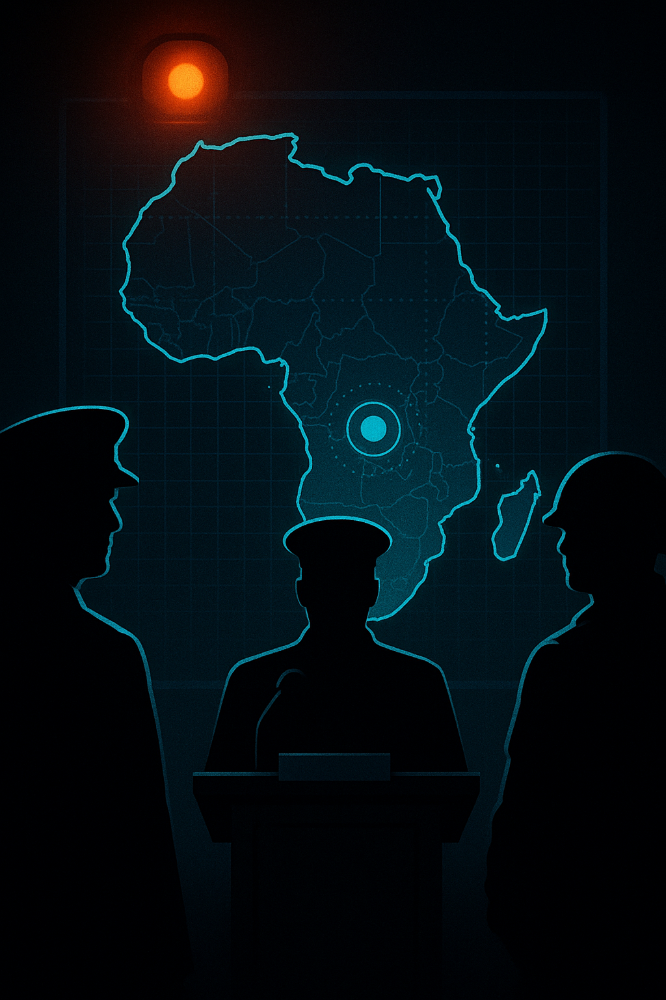

# US-Nigerian forces eliminate ISIS leader, but leadership churn persists.

**Who's posting:** npr (1), x_reuters (1), aljazeera (1), guardian (1), fox (1)  
**Lean mix:** center-left=2, left=1, center=1, right=1

## Sources on the wire

### 🟦 `npr` — left (1 post)
- [Trump says Islamic State group leader was killed in a joint U.S.-Nigerian mission](https://www.npr.org/2026/05/16/g-s1-122461/islamic-state-leader-killed) — _2026-05-16T08:23_

### ⬜ `x_reuters` — center (1 post)
- [Trump says ISIS second-in-command Abu-Bilal al-Minuki killed by US and Nigerian forces http://reut.rs/3Pt1tBM http://reut.rs/3Pt1tBM](https://twitter.com/Reuters/status/2055550078350160049#m) — _2026-05-16T07:25_

### 🟦 `aljazeera` — center-left (1 post)
- [Trump says ISIL second-in-command Abu-Bilal al-Minuki killed](https://www.aljazeera.com/news/2026/5/16/trump-says-isil-second-in-command-abu-bilal-al-minuki-killed?traffic_source=rss) — _2026-05-16T06:16_

### 🟦 `guardian` — center-left (1 post)
- [Trump says Islamic State ‘second in command’ killed by US and Nigerian forces](https://www.theguardian.com/world/2026/may/16/islamic-state-abu-bilal-al-minuki-killed-by-us-nigerian-forces-trump-says) — _2026-05-16T04:56_

### 🟥 `fox` — right (1 post)
- [Trump says Abu-Bilal al-Minuki, second in command of ISIS globally, killed in US-Nigerian operation](https://www.foxnews.com/world/trump-says-abu-bilal-al-minuki-second-command-isis-globally-killed-us-nigerian-operation) — _2026-05-16T04:33_

## Cross-outlet read

**Story grade:** 8/10

**Per-outlet framing:**
- `npr` — Trump announced the operation in a late-night social media post.
- `x_reuters` — wire repeat
- `aljazeera` — The commander was deemed a 'global terrorist' in 2027.
- `guardian` — Trump called al-Minuki ‘most active terrorist in the world’.
- `fox` — Trump identified al-Minuki as the second in command of ISIS globally.

**Framing divergence:**
- [npr, guardian] Trump's personal announcement style is highlighted.
- [aljazeera] Focus on al-Minuki's designation as a 'global terrorist' in 2027.

**Public-opinion sway:** polarizing · ~15pp over ~10d
- ↗ nationalists, conservatives
- ↘ progressives, anti-war advocates
- _Trump's announcement and the mission's success will likely polarize opinions, as he called al-Minuki ‘most active terrorist in the world’._

**Next inflection:** Monitor for official confirmation from U.S. or Nigerian governments and potential retaliatory actions by ISIS factions.

## Persona panel

**Panel:** aisha, devon 🔥, james, maria, robert
🔥 _Devil's advocate: `devon`_
**Outcome:** Devil's advocate swayed the room — final read **35c YES**

- **aisha** (65c): Another high-value target down, but ISIS has been playing musical chairs with leadership for years. They'll promote someone new within weeks - it's like treating symptoms instead of the disease. I'd put this at 65% YES - we're good at finding these guys when we want to.
- **devon** 🔥 (35c): 65c is way too hot — the base rate for confirmed leadership kills is maybe 2-3 per year, and that's across all theaters. ISIS West Africa specifically has gotten way better at compartmentalizing since 2019, plus Nigerian intel capacity is... let's say inconsistent based on the Boko Haram track record. Fade this to 35c, the market's pricing in some Hollywood fantasy where we're just dunking on these guys quarterly.
- **james** (45c): Devon's right that Nigerian intel is spotty, but ISIS leadership structure is more fragile than he's pricing - these aren't the old AQ days where you had deep bench strength. Post-caliphate collapse, they're running lean org charts and we've got better SIGINT on their comms patterns. I'm a buyer at 45c - the base rate argument misses how much easier these ops got once they lost territorial control.

## Polymarket angle

**Polymarket angle (proposed market):** _Will the U.S. confirm another ISIS leadership elimination by end of Q2 2026?_  
slug: `us-isis-leadership-elimination-q2-2026` — full spec in `higgsfield.json#polymarket`

## Hero (reference image for Higgsfield)



## Higgsfield video prompt

```
In a strategic command room, a digital map marks the joint US-Nigerian operation in Africa. Silhouettes of military figures surround a table with US and Nigerian flags, exuding urgency. The room's atmosphere underscores the ongoing battle against ISIS leadership churn.
```

- camera: `dolly_in`
- aspect: `16:9`
- duration: `8s`
- ref image: `./hero.png`

Drop `higgsfield.json` into the Higgsfield API to render.

_Edited by JJJ: Focused on the action of eliminating the ISIS leader while highlighting the ongoing leadership churn, aligning with the room's consensus. Removed hedging and emphasized the persistent challenge of leadership replacement._

_Event ID: `2026-05-16-us-nigerian-forces-eliminate-isis-leader-but-leadership-churn-persists`._
